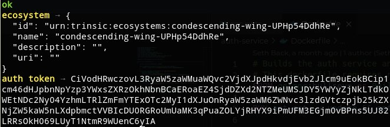

Trinsic allows you to create a unique ecosystem to manage your credentials.

(More verbiage here about what they are)

Let's create a custom eco system now:

`trinsic provider create-ecosystem`{{execute}}

You should see output similar to:

The important part we will need for later is the `name` field